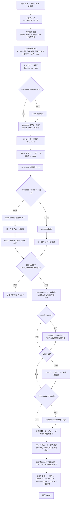
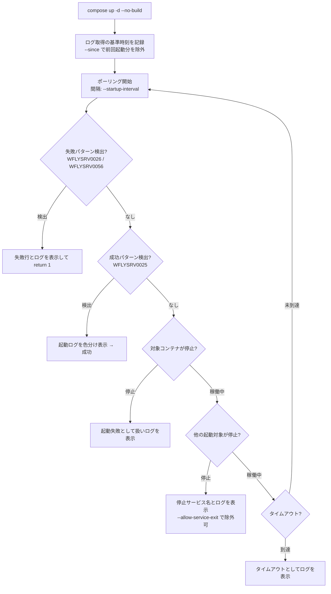

# build_and_verify.sh 詳細ガイド

`compose.yml` でイメージをビルドし、必要に応じて JBoss EAP の起動確認・URL 応答確認・
コンテナ内調査までを行うスクリプトの完全リファレンスです。ECR への操作は一切行いません。

- 対象ファイル: `build_and_verify.sh`
- 想定実行環境: RHEL 9.6 の EC2 インスタンス (bash 5.x / GNU coreutils / Docker CE)
- 呼び出し経路: 直接実行、または `build_and_push.sh --build-only` からの委譲
- 関連ドキュメント: [compose 版ガイド](build_and_push_guide.md) / [buildx 版ガイド](buildx_build_and_push_guide.md)

---

## 目次

1. [このスクリプトの役割](#1-このスクリプトの役割)
2. [全体構成](#2-全体構成)
3. [処理の流れ](#3-処理の流れ)
4. [パラメータ一覧](#4-パラメータ一覧)
5. [パラメータ詳細解説](#5-パラメータ詳細解説)
6. [出力される情報](#6-出力される情報)
7. [環境変数](#7-環境変数)
8. [終了コード](#8-終了コード)
9. [実行例](#9-実行例)
10. [エラーと対処](#10-エラーと対処)

---

## 1. このスクリプトの役割

`build_and_push.sh` の「ビルドのみ実行する処理」を切り出した専用スクリプトです。
ローカルでの動作確認や CI でのビルド検証に使います。

### できること

| # | 機能 | 有効化するオプション |
| --- | --- | --- |
| 1 | compose build によるイメージビルド | (既定。オプション不要) |
| 2 | JBoss EAP (WildFly) の起動完了確認 | `--verify-startup` |
| 3 | URL への HTTP リクエストと応答確認 | `--verify-url` |
| 4 | 同時起動した他 Compose サービスのログ表示 | (起動確認時に自動) |
| 5 | コンテナ内ディレクトリツリー表示 | `--directory-tree-depth` ほか |
| 6 | JBoss デプロイ構造・環境変数一覧の表示 | `--deployment-dir-env` / `--env-list-limit` |
| 7 | Java の JVM パラメータ一覧表示 | (起動確認時に自動) |
| 8 | OpenTelemetry 環境変数・JVM パラメータ一覧表示 | (起動確認時に自動) |
| 9 | 全量レポートのファイル保存 | `--report-dir` |
| 10 | 起動後の対話操作 (bash / HTTP / ログ調査) | `--keep-container-mode` |
| 11 | 終了時の Docker 完全クリーンアップ | `--cleanup-all-docker-data` |

`--verify-startup` も `--verify-url` も指定しなければ、**純粋にビルドのみ**を行って終了します
(従来の `build_and_push.sh --build-only` 相当)。

### 行わないこと

ECR 権限チェック / ECR ログイン / タグ付け / プッシュ / `imagedefinition.json` の出力。

### 前提条件

| 前提 | 内容 |
| --- | --- |
| 必須コマンド | `docker`、`docker compose` または `docker-compose` |
| 追加で必要 | `curl` (`--verify-url` / `--keep-container-mode http` 時)、`aws` (`--jboss-password-param` 時)、Python 3 (`standalone.xml` のパスワード照合、送達診断の JSON 整形時) |
| AWS 認証 | `--jboss-password-param` を使う場合のみ必要 (`aws login --remote` 済み) |

---

## 2. 全体構成

### 2.1 ファイル内のセクション構成

| 位置 | セクション | 内容 |
| --- | --- | --- |
| 冒頭 | ヘッダーコメント | 目的・機能一覧・使い方 |
| 前半 | 表示タイムゾーン設定 | 表示・保存する時刻をすべて JST に固定 |
| 前半 | 既定値 | ビルド / 起動確認 / URL 確認 / 対話操作 / 環境変数一覧 / ツリー / レポートの各既定値 |
| 前半 | ログ用ヘルパ | `log` / `warn` / `err` / `diag` / `run` / JST 変換ヘルパ |
| 中盤 | `usage()` | `--help` の本文 |
| 中盤 | 引数パース | `append_services` によるカンマ区切り分割、`need_value` による値欠落検出 |
| 中盤 | 入力値の検証 | 数値・モード・排他関係・サービス指定の整合性 |
| 中盤 | 依存コマンド / AWS 認証 / compose 判定 | 実行環境の確認 |
| 中盤 | シークレット準備・一時ファイルコピー | `prepare_jboss_password` / `prepare_copy_files` |
| 中盤 | 起動確認・ログ表示ヘルパ | ログ取得、ANSI 除去、色分け、companion ログ |
| 中盤 | 環境変数・ツリー・デプロイ構造 | コンテナ内情報の収集と整形 |
| 中盤 | JVM パラメータ・OpenTelemetry 設定 | `/proc/<pid>/cmdline` の走査、JVM オプションの分類、OpenTelemetry 設定の突き合わせ |
| 中盤 | 対話操作 | bash / HTTP / logs モードと、healthcheck・MySQL・可観測性の各ヘルパ |
| 後半 | Docker 完全クリーンアップ | 対象の集計、確認フレーズ、削除、検証 |
| 後半 | 全量レポート | `write_build_report` |
| 後半 | 後始末 (`cleanup_all`) | EXIT トラップ本体 |
| 末尾 | メイン処理 | ビルド → 起動 → 起動確認 → URL 確認 → 対話 → 情報表示 |

### 2.2 主要な関数グループ

| グループ | 代表的な関数 | 役割 |
| --- | --- | --- |
| ログ・時刻 | `log` / `warn` / `err` / `diag` / `to_jst_display_time` | 出力整形と UTC→JST 変換 |
| 引数処理 | `append_services` / `need_value` / `validate_positive_integer` | カンマ区切り分割、値欠落検出、数値検証 |
| Compose 操作 | `compose_container_ids` / `compose_logs` / `compose_started_services` | 対象サービスの ID・ログ・サービス名取得 |
| 起動確認 | `start_container` / `wait_for_startup` / `containers_all_running` / `target_services_all_running` | 起動、ログポーリング、途中停止の検知 |
| ログ表示 | `show_startup_logs` / `print_startup_logs_with_highlights` / `show_companion_service_logs` | 行数制御と重要ログの色分け |
| URL 確認 | `verify_url` / `show_url_body` | curl のリトライと応答本文表示 |
| 情報表示 | `show_verified_container_envs` / `..._directory_trees` / `..._deployment_structures` | 環境変数・ツリー・デプロイ構造 |
| JVM / OTel | `show_verified_container_jvm_parameters` / `..._otel_settings` / `collect_container_java_processes` / `classify_jvm_option` / `is_otel_jvm_option` | Java プロセスの検出、JVM オプションの分類、OpenTelemetry 設定の集約 |
| 対話操作 | `run_keep_container_interaction` / `run_interactive_compose_service_menu` ほか | bash / HTTP / logs モード |
| healthcheck | `run_interactive_compose_healthcheck` / `run_healthcheck_http_probe` | healthcheck の設定・履歴・通信確認 |
| 可観測性 | `render_cloudwatch_delivery_report` / `run_otel_jaeger_trace_helper` | cwagent / OTel のローカル送達診断 |
| クリーンアップ | `cleanup_all_docker_data` / `teardown_container` / `cleanup_copied_files` | Docker 全体削除と通常後始末 |
| レポート | `write_build_report` / `append_compose_service_logs_report` | 全量レポートの生成 |

### 2.3 EXIT トラップ (`cleanup_all`)

処理のどの経路 (成功・失敗・中断) でも、次の順で実行されます。

```
1. write_build_report        … --report-dir 指定時、全量レポートを保存 (削除より前に実行)
2. cleanup_all_docker_data   … --cleanup-all-docker-data 指定時、確認フレーズ入力後に全削除
3. teardown_container        … compose down (--keep-container 指定時は残す)
4. cleanup_copied_files      … --copy-file でコピーしたファイルを削除
5. 一時ファイル削除          … URL 応答本文・HTTP ボディ・healthcheck 診断の一時ファイル
```

終了コードは、本処理が既に失敗していれば**元の終了コードを優先**します。
成功していた場合は、後始末の結果 (レポート保存失敗やクリーンアップ未承認なら `1`) を返します。

---

## 3. 処理の流れ

### 3.1 全体フロー



エラー終了時は、`EXIT` の後始末でレポートのログ本文を集める直前に
`compose stop` (SIGTERM) を挟みます (3.6 参照)。

### 3.2 ビルドフェーズの詳細

`--compose-service` の指定数によってビルド戦略が変わります。

| 指定 | 動作 |
| --- | --- |
| 未指定 | 全サービスを 1 回の `compose build` でビルド |
| 1 個 | そのサービスのみビルド |
| 2 個以上 | **第 1 フェーズ**: `base` サービスを単独で先行ビルド → ローカルイメージ確認 → **第 2 フェーズ**: `base` 以外をまとめて並列ビルド |

2 段階に分けるのは、ベースイメージを参照するサービスが `base` の完成前にビルドを始めるのを
防ぐためです。並列オプションは compose のバージョンによって使い分けます。

| compose | 並列指定 |
| --- | --- |
| v2 (`docker compose`) | グローバルオプション `--parallel <サービス数>` |
| v1 (`docker-compose`) | `build --parallel` (未対応版は `exit 1`) |

ビルド後は `docker image inspect` でローカルイメージを確認し、
`image=... id=... created=... size=... bytes` を JST 表記でログに残します。

### 3.3 起動確認フェーズの詳細



- `--startup-service` を指定した場合は、**サービスごとに個別**に起動完了を判定し、
  指定した全サービスの完了をもって成功とします
- 未指定の場合は、起動対象全体のログをまとめて判定します
- 既存コンテナを再利用した場合に前回の `WFLYSRV0025` を誤検出しないよう、
  `compose up` の直前時刻を `--since` の基準にします
- 失敗時は `--suppress-startup-logs` を指定していてもログを表示します (原因を隠さないため)

### 3.4 URL 応答確認フェーズの詳細

```
curl -s -S -m 30 -o <一時ファイル> -w '%{http_code}' -X <URL_METHOD> \
     [-k] [-H "Content-Type: <URL_CONTENT_TYPE>"] [--data <ボディ>] <VERIFY_URL>
```

- 期待ステータス (`--expect-status`) と一致するまで `--url-interval` 秒間隔でリトライ
- `--url-timeout` 秒を超えると失敗 (最後の応答コードを表示)
- 接続不可などで応答コードが取れない場合は `000` として扱い、リトライを継続
- 成功・失敗いずれの場合も、応答本文の先頭 20 行を表示

`--verify-startup` を付けず `--verify-url` のみを指定した場合もコンテナは起動します
(起動完了のログ確認は行わず、URL のリトライで readiness を担保します)。

### 3.5 後始末フェーズの詳細

| 状況 | コンテナの扱い |
| --- | --- |
| 通常 | `compose down` で停止・削除 |
| `--keep-container` / `--keep-container-mode` 指定 | 残す (手動停止コマンドを案内) |
| `--cleanup-all-docker-data` 指定 | 確認フレーズ入力後、Docker 全体を削除 |
| `--suppress-removed-logs` 指定 | `compose down` / `compose stop` の出力を抑制 |

### 3.6 エラー終了時の終了 (SIGTERM) ログ

ECS はタスク停止時に各コンテナへ SIGTERM を送るため、adot collector のような
サイドカーは「シグナル受信 → パイプラインの graceful shutdown → 終了」までを
ログに残します。ローカル検証で `compose down` まで一気に実行すると、この終了ログは
誰にも取得されないままコンテナごと削除されてしまいます。

そこで**エラー終了時に限り**、削除の前に SIGTERM による停止を挟みます。

```
[2] 〜 [6] の収集 (起動中のコンテナが必要)
        ↓
compose stop -t <--shutdown-timeout>   ← SIGTERM。既定 30 秒後に SIGKILL
        ↓
終了ログ (停止前後のログ行数の差分) を画面へ表示
        ↓
[7] Compose サービス別ログ (終了処理込みの全文をレポートへ保存)
        ↓
compose down (削除)
```

- 対象は `compose ps --services` が返す**稼働中の全サービス**です
  (起動確認対象だけでなく adot collector などのサイドカーも含みます)
- 表示する行は「SIGTERM 送出前後のログ行数の差分」で求めるため、
  ホストとコンテナの時刻差に影響されません
- 差分が無いコンテナは `SIGTERM 受信後に追加されたログはありません。` と表示します
- `--suppress-startup-logs` を指定していても表示します (原因を隠さないため)
- `--keep-container` / `--keep-container-mode` 指定時はコンテナを停止できないため、
  終了ログの取得も行いません
- `--no-shutdown-logs` を指定すると、この停止と終了ログ取得を丸ごと無効化し、
  従来どおり `compose down` でまとめて削除します

`adot collector` の healthcheck が失敗し、`depends_on` の `condition: service_healthy`
を満たせずバックエンドが起動しなかった場合、ECS 上でも同じくタスクが停止します。
その終了処理まで含めてローカルで再現・確認できるようにするのがこの動作の狙いです。

---

## 4. パラメータ一覧

### 4.1 ビルド関連

| オプション | 値の形式 | 既定値 | 複数 | 説明 |
| --- | --- | --- | --- | --- |
| `--local-image NAME` | イメージ名 | `j1/base.local` | 不可 | compose build で生成されるローカルイメージ名 |
| `--compose-file FILE` | ファイルパス | `compose.yml` | 不可 | compose 定義ファイル |
| `--compose-service NAME` | サービス名 | (全サービス) | **可** (繰り返し / カンマ区切り) | ビルド・起動対象。複数指定時は `base` を先行ビルド。`base` は起動対象にならない |
| `--no-cache` | フラグ | `false` | — | キャッシュを破棄してビルド |
| `--dry-run` | フラグ | `false` | — | ビルド/起動/URL 呼び出し/ファイル操作を行わずプレビュー |
| `--copy-file SRC:DEST_DIR` | `コピー元:コピー先ディレクトリ` | (なし) | **可** | ビルド前にコピーし、終了後に自動削除 |

### 4.2 JBoss マスターパスワード (BuildKit シークレット)

| オプション | 値の形式 | 既定値 | 説明 |
| --- | --- | --- | --- |
| `--jboss-password-param NAME` | SSM パラメータ名 | (なし) | パラメータストアから取得。**このとき AWS 認証が必要** |
| `--jboss-password VALUE` | パスワード文字列 | (なし) | 直接指定。`--jboss-password-param` とは排他 |
| `--jboss-password-env NAME` | 環境変数名 | `JBOSS_MASTER_PASSWORD` | 受け渡しに使う環境変数名。単独指定時は既存の環境変数値を使用 |
| `--region REGION` | AWS リージョン名 | `ap-northeast-1` (env `AWS_REGION`) | パラメータストア参照時のリージョン |

パスワード指定時は、以下の推移診断も自動で有効になります。

| 段階 | 確認内容 | 判定 |
| --- | --- | --- |
| `[1/5]` 取得元 | SSM / 直接指定 / 既存環境変数 | 値を出さず、文字数・UTF-8 バイト数と `$` `#` `!` `"` `` ` `` の出現回数を記録 |
| `[2/5]` export | 取得値と `--jboss-password-env` の値 | バイト列の完全一致 |
| `[3/5]` Compose | `secrets.jboss_master_password.environment` と `build.secrets.source` | 環境変数名・secret id の一致。異なる場合は双方の**設定名**を表示してビルド前に終了 |
| `[4/5]` BuildKit | Dockerfile 有効行の secret mount/read | `id=jboss_master_password` または `/run/secrets/jboss_master_password` を静的確認 |
| `[5/5]` JBoss CLI/XML | 最終イメージの `standalone.xml` | XML エンティティ復元後の `credential-reference clear-text` と入力値を完全一致照合 |

ビルド出力はマスターパスワードの平文・シェル引用・CLI 引用・XML エスケープ形を
逐次 `[REDACTED:JBOSS_MASTER_PASSWORD]` へ置換してから表示します。診断用の
一時ログは権限 600 で作成し、終了時に削除します。値や無塩ハッシュは出力しません。

最終イメージの `EAP_HOME` / `JBOSS_HOME` と標準パス
(`/opt/eap`、`/opt/jboss-eap`、`/opt/jboss/wildfly`、`/opt/wildfly`) を調べ、
コンテナを起動せず `docker create` / `docker cp` で XML を取得します。
literal 値が存在してすべて不一致なら exit 1 です。式・保護値・間接参照だけの場合、
または非 JBoss イメージで XML が無い場合は、直接照合不能であることを警告して
ビルド自体は成功扱いにします。

特殊文字をシェルに解釈させないよう、値は単一引用符で export してください。
LF/CR を含む値は安全な行単位マスクができないため使用できません。

```bash
export JBOSS_MASTER_PASSWORD='Special$#!"`Master'
./build_and_verify.sh --jboss-password-env JBOSS_MASTER_PASSWORD
```

### 4.3 起動確認 (JBoss EAP / WildFly)

| オプション | 値の形式 | 既定値 | 複数 | 説明 |
| --- | --- | --- | --- | --- |
| `--verify-startup` | フラグ | `false` | — | ビルド後にコンテナを起動し、起動完了をログから確認 |
| `--startup-service NAME` | サービス名 | (対象全体) | **可** | 起動完了チェックの対象。指定すると `--verify-startup` を暗黙に有効化 |
| `--startup-log-pattern P` | 拡張正規表現 | `WFLYSRV0025:` | 不可 | 起動完了とみなすログのパターン |
| `--startup-timeout SEC` | 1 以上の整数 | `120` | 不可 | 起動完了を待つ最大秒数 |
| `--startup-interval SEC` | 1 以上の整数 | `3` | 不可 | ポーリング間隔 |
| `--startup-log-lines N\|all` | 1 以上の整数または `all` | `50` | 不可 | 表示するログ行数 (末尾 N 行 / 全行) |
| `--wait-healthy` | フラグ | `false` | — | `compose up` に `--wait` を付け、healthy になるまで compose 側で待つ |
| `--wait-timeout SEC` | 1 以上の整数 | `600` | 不可 | `--wait` の最大待機秒数。指定すると `--wait-healthy` を暗黙に有効化 |
| `--allow-service-exit NAME` | サービス名 | (なし) | **可** | 起動確認中に停止していても失敗扱いにしないサービス |
| `--suppress-startup-logs` | フラグ | `false` | — | 起動ログの表示を抑制 (判定は継続。失敗時は表示される) |
| `--shutdown-timeout SEC` | 1 以上の整数 | `30` | 不可 | エラー終了時の SIGTERM から SIGKILL までの猶予秒数 (ECS の StopTimeout 既定と同じ) |
| `--no-shutdown-logs` | フラグ | `false` | — | エラー終了時の SIGTERM 停止と終了ログ取得を行わない |
| `--suppress-removed-logs` | フラグ | `false` | — | `compose down` / `compose stop` の `Removed` 等の出力を抑制 |
| `--keep-container` | フラグ | `false` | — | 確認後もコンテナを停止・削除しない |

### 4.4 URL 応答確認

| オプション | 値の形式 | 既定値 | 説明 |
| --- | --- | --- | --- |
| `--verify-url URL` | URL | (なし) | 起動確認後にこの URL へリクエストして応答を確認 |
| `--expect-status CODE` | HTTP ステータスコード | `200` | 期待するステータスコード |
| `--url-method METHOD` | HTTP メソッド | `GET` | リクエストメソッド |
| `--url-content-type TYPE` | MIME タイプ | (自動) | `Content-Type` ヘッダ。`--verify-url` と併用必須 |
| `--url-body-json JSON` | JSON 文字列 | (なし) | リクエストボディ。未指定時 `Content-Type: application/json` を自動設定 |
| `--url-body-form DATA` | `key=value&...` | (なし) | リクエストボディ。未指定時 `application/x-www-form-urlencoded` を自動設定 |
| `--url-timeout SEC` | 1 以上の整数 | `60` | 期待応答を得るまでの最大秒数 |
| `--url-interval SEC` | 1 以上の整数 | `3` | リトライ間隔 |
| `--url-insecure` | フラグ | `false` | TLS 証明書検証を無効化 (`curl -k`) |

### 4.5 起動維持後の対話操作

| オプション | 値の形式 | 既定値 | 説明 |
| --- | --- | --- | --- |
| `--keep-container-mode MODE` | `bash` / `http` / `logs` | (なし) | 指定すると `--verify-startup` と `--keep-container` を暗黙に有効化 |
| `--jboss-context-root ROOT` | コンテキストルートのパス | (ログから検出) | `http` モード専用。URL 全体は指定不可 |
| `--jboss-http-port PORT` | 1〜65535 | (ログから検出。既定 8080) | `http` モード専用。公開ポートがあれば自動変換 |

### 4.6 情報表示・レポート

| オプション | 値の形式 | 既定値 | 複数 | 説明 |
| --- | --- | --- | --- | --- |
| `--env-list-limit N\|all` | 1 以上の整数または `all` | `all` | 不可 | 環境変数一覧の表示件数 (コンテナごと) |
| `--env-list-file FILE` | ファイルパス | (なし) | 不可 | 環境変数一覧をファイルにも出力 |
| `--directory-tree-depth N\|all` | 1 以上の整数または `all` | `all` | 不可 | コンテナ内ツリーの最大深さ (`/` 直下を 1 とする) |
| `--directory-file-limit N\|all` | 1 以上の整数または `all` | (ファイル非表示) | 不可 | 通常ファイルの表示を有効化。N 件超過時は拡張子別件数を表示 |
| `--deployment-dir-env NAME` | 環境変数名 | (なし) | **可** | ディレクトリパスを値に持つ環境変数。その配下を階層表示 |
| `--report-dir DIR` | ディレクトリパス | (なし) | 不可 | 全量レポートを `DIR/build_and_verify_<日時>.txt` へ保存 |

### 4.7 終了時のクリーンアップ

| オプション | 値の形式 | 既定値 | 説明 |
| --- | --- | --- | --- |
| `--cleanup-all-docker-data` | フラグ | `false` | 終了時に確認フレーズ入力のうえ、Docker context の全データを削除。`--keep-container` とは排他 |

### 4.8 その他

| オプション | 説明 |
| --- | --- |
| `-h`, `--help` | ヘルプを表示して `exit 0` |

---

## 5. パラメータ詳細解説

### 5.1 `--compose-service` と `base` サービスの扱い

```bash
# 繰り返し指定
./build_and_verify.sh --compose-service app --compose-service db
# カンマ区切り (同じ意味)
./build_and_verify.sh --compose-service app,db
```

| 指定 | ビルド対象 | 起動対象 |
| --- | --- | --- |
| 未指定 | 全サービス | 全サービス |
| `app` | `app` | `app` |
| `app,db` | `base` を先行 → `app`,`db` を並列 | `app`,`db` |
| `base,app` | `base` を先行 → `app` | `app` のみ (`base` は除外) |
| `base` のみ | `base` | なし → 起動確認を伴う場合は `exit 2` |

`base` はベースイメージを提供する**ビルド専用サービス**であり、起動しても即終了するため、
明示指定されていても起動・ログ収集・生存監視の対象からは除外されます。

### 5.2 起動完了の判定パターン

JBoss EAP 8.1 のメッセージ ID で判定します。

| 種別 | パターン (既定) | 意味 |
| --- | --- | --- |
| 成功 | `WFLYSRV0025:` | 正常起動 |
| 失敗 | `WFLYSRV0026:` / `WFLYSRV0056:` | エラー付き起動 / 起動失敗 |

`WFLYSRV0026` を成功扱いしないよう、正常系と異常系を明確に分離しています。
`--startup-log-pattern` で成功パターンを変更できます (拡張正規表現)。

起動ログは意味別に色分けされます (端末へ直接表示する場合のみ。`NO_COLOR` 優先)。

| 色 | 対象 |
| --- | --- |
| 緑 (成功) | `WFLYSRV0025` / `WFLYJCA0018` / `WFLYJCA0001` / `WFLYJCA0098` / `WFLYUT0006` / `WFLYUT0021` / `WFLYSRV0010` |
| シアン (重要) | ドライバー・データソース・デプロイ・リスナー関連の各メッセージ |
| 黄 (警告) | `WARN` / `WARNING` レベル |
| 赤 (エラー) | `ERROR` / `FATAL` レベル、`WFLYSRV0026` / `WFLYSRV0056` |

### 5.3 `--wait-healthy` と依存サービス

`compose up` に `--wait` を付け、対象サービスが healthy (healthcheck 未定義なら running)
になるまで compose 側で待機します。依存サービスの準備完了前にアプリが起動して
失敗するのを防げます。`compose.yml` 側で次の定義が前提です。

```yaml
services:
  db:
    healthcheck:
      test: ["CMD", "mysqladmin", "ping", "-h", "localhost"]
      interval: 5s
      retries: 10
  app:
    depends_on:
      db:
        condition: service_healthy
```

依存サービス (adot collector など) の healthcheck が失敗すると、
`condition: service_healthy` を満たせないまま `compose up` が
`dependency failed to start: container ... is unhealthy` で失敗します。
この場合もエラー終了時の SIGTERM 停止が働くため、依存サービス側の
終了処理ログまで画面と全量レポートに残ります (3.6 参照)。

### 5.4 `--keep-container-mode` の 3 モード

| モード | 動作 |
| --- | --- |
| `bash` | 検証対象コンテナへ `docker exec -it <container> /bin/bash` で直接接続。終了してもコンテナは残る |
| `http` | JBoss EAP のコンテキストルートと HTTP ポートを解決し、パス・メソッド・ボディを対話入力して `curl` を実行 |
| `logs` | 起動中の Compose サービスを番号で選択し、ログ表示・bash 接続・healthcheck 調査・MySQL 実行・送達診断を繰り返す |

いずれも `--verify-startup` と `--keep-container` を暗黙に有効化します。
対象が複数ある場合は番号選択ダイアログが表示されます。

#### `logs` モードで選べる操作

| 操作 | 内容 | 追加要件 |
| --- | --- | --- |
| ログ表示 | 選択サービスのログを `--startup-log-lines` の行数で表示 | — |
| bash 接続 | 選択サービスへ対話接続 | 接続先に `/bin/bash` |
| healthcheck 調査 | 設定・実行履歴・実際の通信確認を表示 (機微情報はマスク) | — |
| MySQL 実行 | MySQL サーバーで SQL を対話実行 | MySQL クライアント |
| CloudWatch Logs 送達診断 | `cwagent` / `cloudwatch-logs-mock` への偽装送達を確認 | `curl` + Python 3 |
| X-Ray トレース診断 | `otel` / `adot-collector` / `jaeger` への偽装トレースを確認 | `curl` + Python 3 |

### 5.5 `--verify-url` 関連オプションの組み合わせ

| 組み合わせ | 可否 |
| --- | --- |
| `--verify-url` 単独 | 可 (コンテナを起動して確認) |
| `--url-body-json` + `--url-body-form` | **不可** (`exit 2`) |
| `--url-content-type` / `--url-body-*` を `--verify-url` 無しで指定 | **不可** (`exit 2`) |
| `--jboss-context-root` / `--jboss-http-port` を `http` モード以外で指定 | **不可** (`exit 2`) |

### 5.6 コンテナ内ディレクトリツリーの表示制御

| オプション | 効果 |
| --- | --- |
| `--directory-tree-depth N` | `/` 直下を深さ 1 として N 階層まで表示 (既定 `all` は最下層まで) |
| `--directory-file-limit N` | 通常ファイルを表示。各ディレクトリ直下が N 件以下なら全ファイル名、超過時は拡張子別件数 |
| `--directory-file-limit all` | 件数にかかわらず全ファイル名を表示 |
| (未指定) | ディレクトリのみ表示 |

巨大・仮想・実行基盤固有のディレクトリは探索を打ち切ります (枝刈り)。

| 扱い | 対象 |
| --- | --- |
| 枝刈り (ノードは表示) | `/proc` `/sys` `/etc` `/usr/lib` `/usr/lib64` `/usr/local` `/aws` `/afs` `/opt/jboss-eap/.galleon` `/opt/jboss-eap/modules/system/layers/base` ほか |
| 非表示 (ノードも出さない) | `/usr/share/X11` `/usr/share/doc` `/usr/share/icons` `/usr/share/licenses` `/usr/share/man` `/usr/share/osinfo` `/usr/share/zoneinfo` |

> これらの表示はコンテナ起動を伴う場合のみ有効です。ビルドのみの実行で指定すると警告が出ます。

### 5.7 `--report-dir` (全量レポート)

| 項目 | 内容 |
| --- | --- |
| ファイル名 | `build_and_verify_<YYYYMMDDHHMMSS>.txt` (同名があれば `_1`, `_2` … を付与) |
| 保存タイミング | EXIT トラップの**最初**。コンテナ削除や Docker 削除より前に取得する |
| 保存内容 | ヘッダー (開始日時・全体結果・compose 定義・ビルド/起動対象) と後述のセクション `[1]`〜`[7]`。JBoss パスワード指定時は `[1-A]` も追加 |
| 失敗時 | `[7]` へ全 Compose サービスのログをサービス単位で全行追記。`[2]`〜`[6]` を集めた後に SIGTERM で停止するため、終了処理のログまで含まれる (3.6 参照) |
| 画面表示との違い | 画面の表示上限 (`--env-list-limit` 等) にかかわらず**常に全量** |
| `--dry-run` | ファイル出力はスキップ (予定のみ表示) |

### 5.8 `--cleanup-all-docker-data` (取り扱い注意)

終了時に、現在の Docker context の**ローカルデータを全削除**します。

| 削除・停止する | 削除しない |
| --- | --- |
| 実行中の全コンテナ (Compose 含む。一時停止中は解除後に停止) | Docker daemon / Docker Desktop |
| 停止済みを含む全コンテナ | 標準ネットワーク |
| 全ローカルイメージ / タグ | Docker context |
| 全ローカルボリュームと永続データ | レジストリ認証情報 |
| 未使用のユーザー定義ネットワーク | daemon 設定 |
| 削除可能な全ビルドキャッシュ | — |

実行直前に対象と件数を表示し、**確認フレーズの入力が必須**です。

```
確認フレーズ: DELETE ALL DOCKER DATA
```

入力できない場合はクリーンアップを実行せず、終了コード `1` になります。
`--keep-container` とは同時に指定できません (`exit 2`)。

> 同じ Docker daemon を使う他プロジェクトにも影響し、元に戻せません。

### 5.9 `--dry-run` の挙動

| 処理 | `--dry-run` 時の動作 |
| --- | --- |
| ビルド / 起動 / down | 実行せず `[DRY-RUN]` 付きで表示 |
| 起動確認 | ポーリング内容を説明するのみ (成功扱い) |
| URL 確認 | curl を実行せず内容を説明 |
| 対話操作 | 実行内容の説明のみ |
| `--copy-file` | コピー・削除を行わず予定を表示 |
| `--report-dir` | ファイル出力をスキップ |
| ローカルイメージ確認 | スキップ |
| AWS 未認証 (`--jboss-password-param` 時) | 中止せず警告のみ |

---

## 6. 出力される情報

### 6.1 画面出力の構成

```
[日時 JST] ログメッセージ …
───────────────────────────────────────────────
コンテナ起動ログ (対象サービス: app, 末尾 50/312 行):
───────────────────────────────────────────────
色分け: 成功 / 重要 / 警告 / エラー
  … (JBoss EAP のログ) …
───────────────────────────────────────────────
(同時起動サービスのログをサービス単位で順次表示)
(URL 応答本文 先頭 20 行)
(環境変数一覧 → ディレクトリツリー → JBoss デプロイ構造
 → JVM パラメータ → OpenTelemetry 環境変数・JVM パラメータ)
```

エラー終了時は、後始末の中で SIGTERM 送出後の終了ログも続けて表示します。

```
───────────────────────────────────────────────
終了 (SIGTERM) 時のコンテナログ (サービス: adot-collector, 追加 3 行):
コンテナ      : adot-collector (状態: exited, 終了コード: 0)
───────────────────────────────────────────────
  … (Received signal from OS … Shutdown complete.) …
───────────────────────────────────────────────
```

### 6.2 出力ファイル

| ファイル | 生成条件 | 内容 |
| --- | --- | --- |
| `--env-list-file` のパス | 指定時 | 環境変数一覧 |
| `--report-dir/build_and_verify_<日時>.txt` | 指定時 | 全量レポート |

全量レポートのセクション構成は次のとおりです。

| セクション | 内容 | コンテナ未起動時 |
| --- | --- | --- |
| `[1] ビルド結果` | 結果 / 詳細 / イメージ情報 / 保存ポリシー | 記録される |
| `[1-A] JBoss マスターパスワード推移診断` | JBoss パスワード指定時のみ。5 段階の照合結果と、マスク済みの失敗根拠 | 記録される |
| `[2] 環境変数一覧 (全件)` | コンテナごとの環境変数を種別付きで全件 | 「未取得」と記録 |
| `[3] コンテナ内ディレクトリツリー (全深度・全ファイル名)` | `/` 起点のツリー | 「未取得」と記録 |
| `[4] JBoss EAP デプロイ構造 (全深度・全ファイル名)` | デプロイ先 / Web ルート / クラスパスルート | 「未取得」と記録 |
| `[5] Java JVM パラメータ (全件)` | Java プロセスごとの JVM パラメータ (分類別) | 「未取得」と記録 |
| `[6] OpenTelemetry 環境変数・JVM パラメータ (全件)` | OpenTelemetry 関連の環境変数と JVM パラメータ | 「未取得」と記録 |
| `[7] Compose サービス別ログ (全サービス・全行)` | 失敗時のみ全サービスのログ全文 (`[7-1]`, `[7-2]` … と採番)。SIGTERM 送出後の終了処理ログまで含む | 定義済みサービスを見出しとして記録 |

一時ファイル (URL 応答本文、対話 HTTP のボディ、healthcheck 診断結果、
権限 600 の JBoss パスワード照合情報・マスク済みビルドログ) は終了時に
自動削除されます。

### 6.3 JVM パラメータ一覧

起動確認を伴う実行では、専用オプションなしで自動表示されます。
対象コンテナ内の `/proc/<pid>/cmdline` を走査し、実行ファイル名が `java` の
プロセスを検出します。コンテナ側へ `ps` / `jcmd` / `jinfo` を要求しないため、
JDK ツールを持たないランタイム専用イメージでも取得できます。

```
[Java プロセス 1] PID: 1
実行ファイル     : /opt/java/openjdk/bin/java
バージョン       : openjdk version "17.0.11" 2024-04-16 LTS
起動対象         : -jar /opt/jboss-eap/jboss-modules.jar
JVM パラメータ数 : 17 件
起動対象への引数 : 4 件
```

JVM パラメータは次の分類で出力します (該当 0 件の分類は表示しません)。

| 分類 | 判定するパラメータ |
| --- | --- |
| ヒープ・メモリ | `-Xms` / `-Xmx` / `-Xss` / `-Xmn` / `-XX:*Metaspace*` / `-XX:*Heap*` / `-XX:*RAM*` / `-XX:MaxDirectMemorySize` / `-XX:*CodeCache*` / `-XX:*CompressedOops*` |
| GC (ガベージコレクション) | `-Xlog:gc*` / `-Xloggc:` / `-XX:*GC*` / `-XX:*SurvivorRatio*` / `-XX:*NewRatio*` / `-XX:*Tenuring*` |
| Java エージェント | `-javaagent:` / `-agentlib:` / `-agentpath:` |
| OpenTelemetry | `-Dotel.*` / `-Dio.opentelemetry.*` |
| JBoss / WildFly | `-Djboss.*` / `-Dorg.jboss.*` / `-Dwildfly.*` / `-Dorg.wildfly.*` / `-Dlogging.configuration` / `-Dmodule.path` |
| システムプロパティ (-D) | 上記に当てはまらない `-D` 指定 |
| クラスパス・モジュール | `-cp` / `-classpath` / `--class-path` / `-p` / `--module-path` / `--add-opens` / `--add-exports` / `--add-modules` / `--add-reads` / `--patch-module` / `-Djava.class.path` / `-Djava.library.path` / `-Xbootclasspath*` |
| その他 JVM オプション | `-server` など上記以外の JVM オプション |
| 起動対象へ渡される引数 | `-jar` / 主クラス / `--module` より後ろの引数 |

- 分類は上表の順に判定し、最初に一致した分類へ入ります。OpenTelemetry の
  `-javaagent:` は「Java エージェント」へ入りますが、OpenTelemetry 一覧側でも
  再掲されます。
- `-cp` のように**値を次の引数として取る**書式は、次の引数を値として取り込みます。
- `-Dkey=value` / `-XX:key=value` / `-javaagent:path` は名前と値に分けて桁揃えします。
- 値を持たないオプション (`-server`、`-XX:+UseG1GC`、`-Xmx1024m` など) は名前だけを出します。
- 名前に `PASSWORD` / `TOKEN` / `SECRET` / `HEADERS` などを含む場合は
  値を `[REDACTED]` にします (`-Djboss.password=...` など)。
- 次の環境変数は指定内容が起動コマンドラインに現れないため、
  `[JVM オプションを渡す環境変数]` として別枠で表示します。

  `JAVA_OPTS` / `JAVA_OPTS_APPEND` / `JAVA_TOOL_OPTIONS` / `JDK_JAVA_OPTIONS` /
  `_JAVA_OPTIONS` / `JBOSS_JAVA_OPTS` / `JBOSS_JAVA_SIZING` / `JAVA_ARGS`

- Java プロセスを検出できないコンテナ (DB、Collector など) では、その旨を表示して
  次のコンテナへ進みます (失敗扱いにはしません)。

### 6.4 OpenTelemetry 環境変数・JVM パラメータ一覧

OpenTelemetry の設定は「環境変数」と「JVM システムプロパティ」の 2 経路で与えられます。
どちらか一方だけでは実際の構成が判断できないため、両方を 1 つの一覧にまとめます。
Java を実行しないコンテナ (OTel Collector など) でも環境変数側は同じ形式で確認できます。

| 種別 | 判定条件 |
| --- | --- |
| OpenTelemetry 標準環境変数 (`OTEL_*`) | 名前が `OTEL_` で始まる環境変数すべて |
| OpenTelemetry 関連環境変数 | `AWS_XRAY_DAEMON_ADDRESS` / `AWS_XRAY_CONTEXT_MISSING` / `AWS_XRAY_TRACING_NAME` / `AWS_LAMBDA_EXEC_WRAPPER` / `AOT_CONFIG_CONTENT`。加えて `JAVA_TOOL_OPTIONS` / `JDK_JAVA_OPTIONS` / `_JAVA_OPTIONS` / `JAVA_OPTS` / `JAVA_OPTS_APPEND` / `JBOSS_JAVA_OPTS` は、値が OpenTelemetry を参照している場合のみ |
| OpenTelemetry 関連 JVM パラメータ (コマンドライン) | `-Dotel.*` / `-Dio.opentelemetry.*` / 値に `opentelemetry` を含むもの / `-javaagent:*otel*` などの各エージェント指定 |
| OpenTelemetry 関連 JVM パラメータ (環境変数由来) | 上記の JVM オプション用環境変数の値に含まれる同じパラメータ (`<環境変数名>: <パラメータ名>` の形式で表示) |
| 未設定の主要 OpenTelemetry 設定 | 主要設定のうち、環境変数と対応するシステムプロパティのどちらにも指定が無いもの |

- `OTEL_` は OpenTelemetry 仕様が定める設定名の接頭辞です。接頭辞で判定するため、
  `OTEL_SERVICE_NAME` / `OTEL_RESOURCE_ATTRIBUTES` / `OTEL_TRACES_EXPORTER` /
  `OTEL_METRICS_EXPORTER` / `OTEL_LOGS_EXPORTER` / `OTEL_EXPORTER_OTLP_*` /
  `OTEL_PROPAGATORS` / `OTEL_TRACES_SAMPLER` / `OTEL_BSP_*` /
  `OTEL_INSTRUMENTATION_*` / `OTEL_JAVAAGENT_*` / `OTEL_SDK_DISABLED` などを
  個別に列挙しなくても検出でき、仕様追加で増えた設定名にも追随します。
- 環境変数とシステムプロパティの対応は、Java エージェントの規則に合わせて
  「小文字化して `_` を `.` へ置換」で求めます (`OTEL_SERVICE_NAME` ⇔ `otel.service.name`)。
- 「未設定」の判定対象は次の 10 件です。トレースやメトリクスが届かないときに
  「そもそも設定されていない」ケースを切り分けられます。

  `OTEL_SERVICE_NAME` / `OTEL_RESOURCE_ATTRIBUTES` / `OTEL_TRACES_EXPORTER` /
  `OTEL_METRICS_EXPORTER` / `OTEL_LOGS_EXPORTER` / `OTEL_EXPORTER_OTLP_ENDPOINT` /
  `OTEL_EXPORTER_OTLP_PROTOCOL` / `OTEL_PROPAGATORS` / `OTEL_TRACES_SAMPLER` /
  `OTEL_SDK_DISABLED`

- `OTEL_EXPORTER_OTLP_HEADERS` のように認証情報を載せやすい名前の値は
  `[REDACTED]` で表示します。
- 4 種別すべてが 0 件の場合は
  「OpenTelemetry 関連の環境変数・JVM パラメータは検出されませんでした。」とだけ表示します。
- Collector 側の稼働確認・送達確認は `--keep-container-mode logs` の
  送達診断 (5.4 参照) を使います。この一覧は**設定値の確認**が目的です。

---

## 7. 環境変数

### 7.1 入力として参照する環境変数

| 環境変数 | 説明 |
| --- | --- |
| `AWS_REGION` → `AWS_DEFAULT_REGION` | `--region` の既定値 (パラメータストア参照時) |
| `JBOSS_MASTER_PASSWORD` (既定名) | `--jboss-password-env` 単独指定時に使用 |
| `BUILDKIT_PROGRESS` | ビルドログの表示形式。未指定時は `plain` を使用 |
| `NO_COLOR` | 定義されていれば色分けを無効化 |
| `CLICOLOR_FORCE` | `0` 以外なら、非 tty でも色分けを強制 |
| `TERM` | `dumb` の場合は色分けしない |

### 7.2 スクリプトが設定する環境変数

| 環境変数 | 用途 |
| --- | --- |
| `TZ` | `Asia/Tokyo` または `JST-9`。表示・保存時刻を JST に統一 |
| `BUILDKIT_PROGRESS` | 既定 `plain`。tty の上書き表示でビルドログが欠落するのを防ぐ |
| `<--jboss-password-env の値>` | BuildKit シークレットとして compose へ渡す |
| `JBOSS_MASTER_PASSWORD` | 同梱 `compose.yml` 用に必ず定義 (未使用時は空文字) |

### 7.3 コンテナ側で検出する環境変数

7.1 / 7.2 はスクリプト自身が実行ホストで参照・設定する環境変数です。
これとは別に、**起動したコンテナ内の環境変数**を収集して一覧表示します
(スクリプトの動作は変えません)。

| 用途 | 環境変数 | 出力先 |
| --- | --- | --- |
| JVM オプションの受け渡し | `JAVA_OPTS` / `JAVA_OPTS_APPEND` / `JAVA_TOOL_OPTIONS` / `JDK_JAVA_OPTIONS` / `_JAVA_OPTIONS` / `JBOSS_JAVA_OPTS` / `JBOSS_JAVA_SIZING` / `JAVA_ARGS` | JVM パラメータ一覧 (6.3) |
| OpenTelemetry 標準設定 | `OTEL_` で始まる環境変数すべて | OpenTelemetry 一覧 (6.4) |
| OpenTelemetry 関連設定 | `AWS_XRAY_DAEMON_ADDRESS` / `AWS_XRAY_CONTEXT_MISSING` / `AWS_XRAY_TRACING_NAME` / `AWS_LAMBDA_EXEC_WRAPPER` / `AOT_CONFIG_CONTENT` | OpenTelemetry 一覧 (6.4) |
| ディレクトリ構造の起点 | `--deployment-dir-env` で指定した名前 | JBoss デプロイ構造 |

---

## 8. 終了コード

| コード | 意味 | 主な発生条件 |
| --- | --- | --- |
| `0` | 正常終了 | ビルド (と指定した確認) がすべて成功 |
| `1` | 実行時エラー | 必須コマンド不足、AWS 未認証、SSM 取得失敗、コピー失敗、ビルド失敗、ローカルイメージ未検出、コンテナ起動失敗、起動確認失敗 (タイムアウト・失敗パターン検出・途中停止)、URL 応答確認失敗、対話操作失敗、レポート保存失敗、Docker クリーンアップ未承認 |
| `2` | 引数エラー | 不明なオプション、値の欠落、数値が 1 未満、`--keep-container-mode` の不正値、`--jboss-http-port` の範囲外、オプションの排他違反、`--startup-service` が `--compose-service` に含まれない、起動対象が `base` のみ、`--copy-file` の書式不正 |

本処理が失敗している場合は、後始末の結果にかかわらず**元の終了コードが優先**されます。

---

## 9. 実行例

```bash
# 1) ビルドのみ
./build_and_verify.sh

# 2) ビルド + JBoss EAP の起動確認
./build_and_verify.sh --verify-startup

# 3) 起動確認 + ヘルスチェック URL の応答確認
./build_and_verify.sh --verify-startup \
    --verify-url http://localhost:8080/health --expect-status 200

# 4) 複数サービスを同時に起動し、app のみ起動確認する
./build_and_verify.sh --compose-service app,db --startup-service app

# 5) 依存サービスが healthy になるまで待ってから起動確認
./build_and_verify.sh --compose-service app,db --startup-service app \
    --wait-healthy --wait-timeout 300

# 6) 初期化専用サービスの停止を失敗扱いにしない
./build_and_verify.sh --compose-service app,db,init --startup-service app \
    --allow-service-exit init

# 7) POST でボディを送って確認
./build_and_verify.sh --verify-startup \
    --verify-url http://localhost:8080/app/api --url-method POST \
    --url-body-json '{"id":1}' --expect-status 201

# 8) 起動後にコンテナへ bash で入る
./build_and_verify.sh --keep-container-mode bash

# 9) 起動後に対話式 HTTP リクエストを送る
./build_and_verify.sh --keep-container-mode http \
    --jboss-context-root /app --jboss-http-port 8080

# 10) 起動中サービスのログ・healthcheck・送達診断を調べる
./build_and_verify.sh --compose-service app,db,cwagent --keep-container-mode logs

# 11) 全量レポートとコンテナ内ツリーを保存
#     (JVM パラメータと OpenTelemetry 設定も同じレポートへ保存される)
./build_and_verify.sh --verify-startup \
    --report-dir ./reports --directory-tree-depth 3 --directory-file-limit 20

# 12) デプロイ構造を環境変数から特定して表示
./build_and_verify.sh --verify-startup \
    --deployment-dir-env JBOSS_HOME,APP_DEPLOY_DIR

# 13) 認証情報を一時配置してビルド
./build_and_verify.sh --copy-file .npmrc:./app

# 14) パラメータストアのマスターパスワードを使ってビルド
./build_and_verify.sh --jboss-password-param /j1/jboss/master-password

# 15) 検証後に Docker を完全クリーンアップ (確認フレーズ入力が必要)
./build_and_verify.sh --verify-startup --cleanup-all-docker-data

# 16) build_and_push.sh 経由での呼び出し (同じ処理)
./build_and_push.sh --build-only --verify-startup --log-dir ./logs
```

---

## 10. エラーと対処

| メッセージ | 原因 | 対処 |
| --- | --- | --- |
| `必須コマンドが見つかりません: curl` | `--verify-url` / `http` モードで curl が無い | curl をインストール |
| `AWS 認証が確認できません` | `--jboss-password-param` 指定時に未認証 | `aws login --remote` を実行 |
| `docker compose / docker-compose が見つかりません` | compose 未導入 | compose プラグインを導入 |
| `複数サービスの並列ビルドには --parallel 対応の docker-compose が必要です` | v1 が古い | compose v2 へ移行 |
| `オプションに値が指定されていません: --verify-url` | 値の欠落 | 値を指定する |
| `--startup-log-lines には 1 以上の整数を指定してください` | 0 や非数値 | 1 以上の整数か `all` |
| `--startup-service 'x' が --compose-service で指定した対象に含まれていません` | 指定の不整合 | 起動対象にも同じサービスを含める |
| `--compose-service にベースサービス 'base' しか指定されていないため、起動対象がありません` | `base` のみ指定で起動確認 | 起動したいサービスも指定する |
| `--cleanup-all-docker-data と --keep-container は同時に指定できません` | 排他違反 | どちらか一方にする |
| `--jboss-context-root / --jboss-http-port は --keep-container-mode http と併用してください` | 併用条件違反 | `--keep-container-mode http` を付ける |
| `--url-body-json と --url-body-form は同時に指定できません` | ボディの二重指定 | どちらか一方にする |
| `ローカルベースイメージが見つかりません` | `compose.yml` の `image:` と `--local-image` が不一致 | 両者を一致させる |
| `環境変数名が不一致です` | `--jboss-password-env` と Compose secret の `environment` が異なる | 表示された 2 つの設定名を一致させる |
| `standalone.xml 側の credential-store マスターパスワードと入力値が一致しません` | BuildKit secret の読取り、JBoss CLI の引用・エスケープ、または XML 生成までに値が変化 | `[1-A]` の `[1/5]`〜`[5/5]` と credential-store 名を確認 |
| `ビルド失敗は JBoss マスターパスワード...に関連している可能性が高い` | JBoss CLI / Elytron / credential-store の復号・引用エラーを検出 | マスク済み抜粋の「エラーが示す照合点」を確認。既存 credential-store を再利用する場合は、その暗号化時パスワードとの一致も確認 |
| `JBoss EAP 8.1 が正常起動しませんでした` | `WFLYSRV0026` / `WFLYSRV0056` を検出 | 表示された失敗行と起動ログを確認 |
| `コンテナの起動に失敗しました (compose up)` | 依存サービスの healthcheck 失敗で `condition: service_healthy` を満たせない等 | `dependency failed to start` の対象サービスと、続けて表示される `終了 (SIGTERM) 時のコンテナログ` を確認 |
| `コンテナが起動途中で停止しました` | アプリの異常終了 | 表示されたログで原因を確認 |
| `SIGTERM による停止に失敗しました (compose stop, exit=…)` | `compose stop` が失敗 (daemon 応答なし等) | 終了処理のログが欠ける場合がある。`docker ps -a` で状態を確認 |
| `起動対象の Compose サービスが停止しました` | 依存サービスの準備不足など | `--wait-healthy` の利用、`--allow-service-exit` での除外を検討 |
| `起動確認がタイムアウトしました` | 起動が遅い / パターン不一致 | `--startup-timeout` を延長、`--startup-log-pattern` を確認 |
| `URL 応答の確認に失敗しました` | ポート・パス・期待ステータスの誤り | 表示された最後の応答コードと本文を確認 |
| `全量ビルドレポートの出力先を作成できませんでした` | `--report-dir` の権限不足 | 書き込み可能なパスを指定 |
| `Java プロセスを検出できませんでした。` | 対象コンテナが JVM を実行していない、または `/proc` / `/bin/sh` を読み取れない | JVM を持たないコンテナ (DB / Collector など) なら想定どおり。JBoss のコンテナで出る場合は起動状態と `docker exec <cid> /bin/sh` の可否を確認 |
| `バージョン       : (取得できませんでした)` | `java -version` を実行できない (実行ファイルのパスを解決できない等) | JVM パラメータ自体は表示されるため情報表示のみの影響。必要なら `docker exec <cid> <java> -version` を直接確認 |
| `OpenTelemetry 関連の環境変数・JVM パラメータは検出されませんでした。` | `OTEL_*` も `-Dotel.*` も javaagent も設定されていない | `compose.yml` の `environment` や `JAVA_TOOL_OPTIONS` の設定漏れを確認 |
