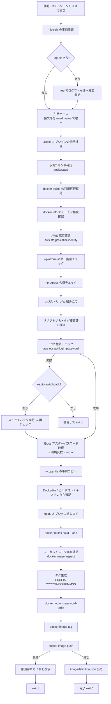
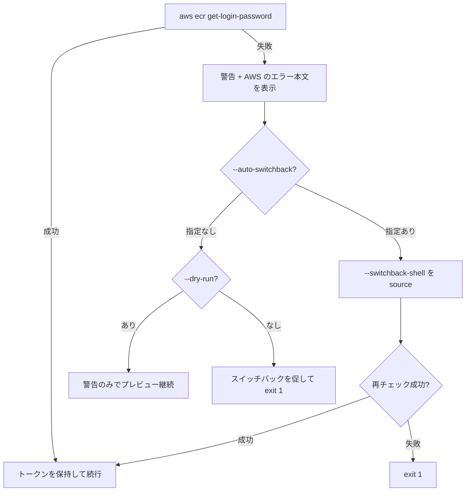

# buildx_build_and_push.sh 詳細ガイド

`docker buildx` で Dockerfile を直接ビルドし、ECR へタグ付け・プッシュして
`imagedefinition.json` を出力するスクリプトの完全リファレンスです。

- 対象ファイル: `buildx_build_and_push.sh`
- 想定実行環境: RHEL 9.6 の EC2 インスタンス (bash 5.x / GNU coreutils / Docker CE)
- 関連ドキュメント: [compose 版ガイド](build_and_push_guide.md) / [ビルド・動作確認ガイド](build_and_verify_guide.md)

---

## 目次

1. [このスクリプトの役割](#1-このスクリプトの役割)
2. [compose 版との違い](#2-compose-版との違い)
3. [全体構成](#3-全体構成)
4. [処理の流れ](#4-処理の流れ)
5. [パラメータ一覧](#5-パラメータ一覧)
6. [パラメータ詳細解説](#6-パラメータ詳細解説)
7. [環境変数](#7-環境変数)
8. [終了コード](#8-終了コード)
9. [入出力ファイル](#9-入出力ファイル)
10. [実行例](#10-実行例)
11. [エラーと対処](#11-エラーと対処)

---

## 1. このスクリプトの役割

`compose.yml` を使わず、`docker buildx build` で Dockerfile から直接ローカルベースイメージ
(既定 `j1/base.local`) を生成し、ECR へ「日時付きタグ」でプッシュします。
最後に CodePipeline の ECS デプロイで使う `imagedefinition.json` を出力します。

```
Dockerfile ──> docker buildx build --load -t j1/base.local ──> ローカル docker イメージストア
                                                                     │
                                                          docker image tag
                                                                     ▼
        <account>.dkr.ecr.<region>.amazonaws.com/<repository>:<prefix>-<YYYYMMDDHHMMSS>
                                                                     │
                                                          docker image push
                                                                     ▼
                                                        imagedefinition.json 出力
```

### 前提条件

| 前提 | 内容 |
| --- | --- |
| 認証 | 実行前に `aws login --remote` 済みであること。未認証なら `exit 1` |
| 権限 | ECR の操作権限。CodeCommit の権限は不要 |
| 権限が無い場合 | 既定は警告して終了 (`--warn-only`)。`--auto-switchback` で自動スイッチバック |
| 必須コマンド | `docker`、`aws`、`docker buildx` プラグイン |
| Docker | デーモンに接続できること (起動時に `docker info` で確認) |

buildx プラグインが無い場合は次のように案内して終了します。

```
[ERROR] docker buildx が利用できません。docker-buildx-plugin をインストールしてください。
[ERROR]   例) dnf install docker-buildx-plugin
```

---

## 2. compose 版との違い

| 観点 | `build_and_push.sh` (compose 版) | `buildx_build_and_push.sh` (このスクリプト) |
| --- | --- | --- |
| ビルド方法 | `docker compose build` | `docker buildx build --load` |
| ビルド定義 | `compose.yml` | `Dockerfile` + ビルドコンテキスト |
| イメージ名の決定 | `compose.yml` の `image:` | `-t` (= `--local-image`) |
| シークレット注入 | `compose.yml` の `secrets` (environment 型) | `--secret id=...,env=...` |
| ビルド引数 | `compose.yml` に記述 | `--build-arg` |
| 追加コンテキスト | (compose の設定) | `--build-context` |
| プラットフォーム指定 | 不可 | `--platform` (単一のみ) |
| ビルダー選択 | 不可 | `--builder` |
| 進捗表示形式 | BuildKit 既定 | `--progress` |
| `--build-only` 委譲 | あり (`build_and_verify.sh`) | **なし** |
| ECR ログイン以降 | 共通 (タグ付け → プッシュ → imagedefinition) | 共通 |

ECR 接続、権限チェック、スイッチバック、JBoss パスワード取得、`--copy-file`、
`--log-dir`、`--dry-run`、push 失敗診断の仕様は **compose 版と同一**です。

---

## 3. 全体構成

### 3.1 ファイル内のセクション構成

| 位置 | セクション | 内容 |
| --- | --- | --- |
| 冒頭 | ヘッダーコメント | 目的・前提・使い方 |
| 前半 | 表示タイムゾーン設定 | ログ・タグ・ログファイル名の時刻を JST に固定 |
| 前半 | 既定値 | 全パラメータの初期値 |
| 前半 | ログ用ヘルパ | `log` / `warn` / `err` / `diag` / `run` / `log_elapsed` ほか |
| 中盤 | `usage()` | `--help` の本文 |
| 中盤 | ログファイル出力の準備 | `--log-dir` の事前走査と `tee` によるログ複製 |
| 中盤 | 引数パース | 本パース (`need_value` で値欠落を検出) |
| 中盤 | 各種検証 | JBoss オプション / 依存コマンド / buildx / Docker / AWS 認証 / platform / progress / イメージ参照 |
| 後半 | ECR 権限チェック・スイッチバック | `check_ecr_permission` / `do_switchback` |
| 後半 | シークレット準備 | `prepare_jboss_password` |
| 後半 | 一時ファイルコピー | `prepare_copy_files` / `cleanup_copied_files` |
| 後半 | push 失敗診断 | 5 種の原因ガイド + `diagnose_push_failure` |
| 末尾 | メイン処理 | buildx build → タグ付け → ログイン → プッシュ → 出力 |

### 3.2 主要な関数

| 関数 | 役割 |
| --- | --- |
| `setup_display_timezone` | `Asia/Tokyo` → `JST-9` の順に試し、表示時刻を JST に固定 |
| `log` / `warn` / `err` / `diag` | ログ出力ヘルパ |
| `run` | `--dry-run` 時はコマンドを表示するだけ |
| `log_elapsed` | 経過秒数を `HH:MM:SS` 付きで出力 (EXIT トラップ) |
| `finish_logging` | ログ複製 (tee) を閉じて書き込み完了を待つ |
| `new_temp_file` / `cleanup_temp_files` | 一時ファイルの安全な作成と一括削除 |
| `json_escape` | `imagedefinition.json` 用の JSON エスケープ |
| `arg_takes_value` | 事前走査で「値を取るオプション」を判定 |
| `need_value` | 値の欠落を検出してエラー終了 |
| `check_ecr_permission` / `warn_ecr_auth_error` | ECR 権限判定と AWS エラー本文の表示 |
| `do_switchback` | スイッチバック用シェルを `source` |
| `prepare_jboss_password` | マスターパスワードを取得して環境変数へ export |
| `prepare_copy_files` / `cleanup_copied_files` | 一時コピーと自動削除 |
| `diagnose_push_failure` | push 失敗時の原因切り分けと調査手順の表示 |

### 3.3 EXIT トラップ

```
cleanup_copied_files   … --copy-file でコピーしたファイルを削除
cleanup_temp_files     … 一時ファイル (push ログ・SSM エラー出力) を削除
log_elapsed            … 処理実行時間を記録
finish_logging         … ログファイルへの書き込みを完了させる
```

SIGINT (Ctrl-C) / SIGTERM で中断した場合も実行されます。

---

## 4. 処理の流れ

### 4.1 全体フロー



### 4.2 各ステップの詳細

| # | ステップ | 内容 | 失敗時 |
| --- | --- | --- | --- |
| 1 | タイムゾーン設定 | `Asia/Tokyo` → `JST-9` の順にフォールバック | 警告のみ |
| 2 | `--log-dir` 事前走査 | 本パース前にログ複製を開始するため、値のみ先に取得。値を取るオプションの値は読み飛ばす | — |
| 3 | ログ複製開始 | `DIR/buildx_build_and_push_<YYYYMMDDHHMMSS>.log` へ全出力を複製。**パースエラーも記録される** | ディレクトリ作成失敗で `exit 1` |
| 4 | 引数パース | 全オプションを解釈。値の欠落は `exit 2` | `exit 2` |
| 5 | JBoss オプション検証 | 取得元の排他、環境変数名の形式、`--jboss-secret-id` の空文字禁止 | `exit 2` |
| 6 | 必須コマンド確認 | `aws`、`docker` | `exit 1` |
| 7 | buildx 確認 | `docker buildx version` | `exit 1` |
| 8 | Docker 接続確認 | `docker info` (`--dry-run` 時は警告のみ) | `exit 1` |
| 9 | AWS 認証確認 | `aws sts get-caller-identity` (`--dry-run` 時は警告のみ) | `exit 1` |
| 10 | platform 検証 | `--load` のため複数プラットフォーム (`,` 区切り) は不可 | `exit 2` |
| 11 | progress 検証 | `auto` / `plain` / `tty` / `rawjson` / `quiet` のみ許可 | `exit 2` |
| 12 | レジストリ URL | `--registry` か `<account-id>.dkr.ecr.<region>.amazonaws.com`。末尾 `/` は除去 | `exit 2` |
| 13 | イメージ参照の検証 | `--repository` は小文字のみ、`--tag-prefix` は英数字と `. _ -`。**ビルド前**に検証 | `exit 2` |
| 14 | ECR 権限チェック | `aws ecr get-login-password`。成功時のトークンは後段の `docker login` に再利用 | 下記 4.3 |
| 15 | シークレット準備 | パラメータストア / 直接指定 / 既存環境変数から取得し export | `exit 1` |
| 16 | 事前コピー | `--copy-file SRC:DEST_DIR` をコピー。終了時に自動削除 | `exit 1` / `exit 2` |
| 17 | 入力確認 | `--dockerfile` のファイルと `--context` のディレクトリの存在確認 | `exit 1` |
| 18 | ビルド | `docker buildx build --load -t <local-image> -f <dockerfile> [オプション] <context>` | `exit 1` |
| 19 | イメージ確認 | `docker image inspect` (`--dry-run` 時はスキップ) | `exit 1` |
| 20 | タグ生成 | `<TAG_PREFIX>-<YYYYMMDDHHMMSS>` (JST) | — |
| 21 | ECR ログイン | `docker login --username AWS --password-stdin` | `exit 1` |
| 22 | タグ付け・プッシュ | `docker image tag` → `docker image push` (出力は `tee` で保存) | `exit 1` + 診断 |
| 23 | 出力 | `imagedefinition.json` を書き込み (失敗も検出) | `exit 1` |

### 4.3 ECR 権限チェックの分岐



### 4.4 buildx コマンドの組み立て順

実際に実行されるコマンドは次の順序で構築されます。

```
docker buildx build \
  --load  -t <LOCAL_IMAGE>  -f <DOCKERFILE> \
  [--builder <BUILDER>] \
  [--platform <PLATFORM>] \
  [--progress <PROGRESS>] \
  [--no-cache] \
  [--build-arg KEY=VALUE ...] \
  [--build-context NAME=VALUE ...] \
  [--secret <SPEC> ...] \
  [--secret id=<JBOSS_SECRET_ID>,env=<JBOSS_PASSWORD_ENV>] \
  <BUILD_CONTEXT>
```

- `--load` は常に付与されます (`docker image tag` / `docker image push` を使うため)
- JBoss シークレットは `--secret` の**最後**に追加されます
- `--secret` の引数に含まれるのは id と環境変数名のみで、パスワードの値は含まれません
  (`--dry-run` のプレビューにも値は出ません)

### 4.5 push 失敗時の自動診断

`docker image push` が失敗すると、出力内容と AWS API の応答から原因を推定し、
該当カテゴリの調査手順を表示します (compose 版と共通)。

| カテゴリ | 検出キーワード例 | 主な調査項目 |
| --- | --- | --- |
| A. IAM 権限エラー | `not authorized to perform`、`denied:` | `sts get-caller-identity`、`simulate-principal-policy`、CloudTrail |
| B. エンドポイント権限設定 | 同上 (A と併記) | リポジトリポリシー、VPC エンドポイントポリシー |
| C. エンドポイント不存在 | `no such host`、`dial tcp`、`i/o timeout` | ecr.api / ecr.dkr / s3 エンドポイント、PrivateDNS、SG |
| D. リポジトリ不存在 | `name unknown`、`does not exist` | `describe-repositories`、リージョン取り違え |
| E. トークン期限切れ | `authorization token has expired`、`401 Unauthorized` | 再ログイン手順 |

---

## 5. パラメータ一覧

### 5.1 ECR 接続先の指定

| オプション | 値の形式 | 既定値 | 必須 | 説明 |
| --- | --- | --- | --- | --- |
| `--account-id ID` | 12 桁の AWS アカウント ID | env `AWS_ACCOUNT_ID` | `--registry` 未指定時は必須 | レジストリ URL の組み立てに使用 |
| `--region REGION` | AWS リージョン名 | `ap-northeast-1` (env `AWS_REGION` → `AWS_DEFAULT_REGION`) | 任意 | ECR / SSM の対象リージョン |
| `--registry URL` | `<account>.dkr.ecr.<region>.amazonaws.com` | env `ECR_REGISTRY` | 任意 | 直接指定。末尾 `/` は自動除去 |
| `--repository NAME` | 小文字英数字と `. _ - /` | `baseimage` | 任意 | ECR リポジトリ名。**大文字は使用不可** |
| `--tag-prefix PREFIX` | 英数字と `. _ -` (先頭は英数字か `_`、113 文字以内) | `BaseImage` | 任意 | タグは `<PREFIX>-<YYYYMMDDHHMMSS>`。大文字も可 |

### 5.2 buildx ビルド関連 (このスクリプト固有)

| オプション | 値の形式 | 既定値 | 複数 | 説明 |
| --- | --- | --- | --- | --- |
| `--local-image NAME` | イメージ名 | `j1/base.local` | 不可 | `-t` に渡すローカルイメージ名 |
| `--dockerfile FILE` | ファイルパス | `Dockerfile` | 不可 | `-f` に渡す Dockerfile |
| `--context DIR` | ディレクトリパス | `.` | 不可 | ビルドコンテキスト |
| `--platform PLATFORM` | 例: `linux/amd64` | (なし) | 不可 | `--load` のため**単一プラットフォームのみ**。`,` 区切りは `exit 2` |
| `--builder NAME` | buildx ビルダー名 | (現在のビルダー) | 不可 | 使用するビルダーを切り替える |
| `--build-arg KEY=VALUE` | `KEY=VALUE` | (なし) | **可** | ビルド引数 |
| `--build-context NAME=VALUE` | `NAME=VALUE` | (なし) | **可** | 追加のビルドコンテキスト。`FROM` / `COPY --from=` で名前参照できる |
| `--secret SPEC` | buildx の `--secret` と同一書式 | (なし) | **可** | 例: `id=npmrc,src=./.npmrc` / `id=token,env=GITHUB_TOKEN` |
| `--progress MODE` | `auto`/`plain`/`tty`/`rawjson`/`quiet` | (buildx 既定) | 不可 | CI ログには `plain` が読みやすい |
| `--no-cache` | フラグ | `false` | — | キャッシュを破棄してビルド |

### 5.3 出力・実行制御

| オプション | 値の形式 | 既定値 | 説明 |
| --- | --- | --- | --- |
| `--container-name NAME` | 任意の文字列 | `--repository` の値 | `imagedefinition.json` の `name` |
| `--output FILE` | ファイルパス | `imagedefinition.json` | imagedefinition の出力先 |
| `--log-dir DIR` | ディレクトリパス | (なし) | 画面出力を `DIR/buildx_build_and_push_<日時>.log` にも保存 |
| `--dry-run` | フラグ | `false` | ビルド/ログイン/タグ付け/プッシュ/ファイル出力を行わずプレビュー |
| `-h`, `--help` | フラグ | — | ヘルプを表示して `exit 0` |

### 5.4 ビルド前後の一時ファイル

| オプション | 値の形式 | 既定値 | 複数 | 説明 |
| --- | --- | --- | --- | --- |
| `--copy-file SRC:DEST_DIR` | `コピー元:コピー先ディレクトリ` | (なし) | **可** | ビルド前にコピーし、終了後に自動削除 |

### 5.5 JBoss マスターパスワード (BuildKit シークレット)

| オプション | 値の形式 | 既定値 | 説明 |
| --- | --- | --- | --- |
| `--jboss-password-param NAME` | SSM パラメータ名 | (なし) | パラメータストアから取得 (`--with-decryption`) |
| `--jboss-password VALUE` | パスワード文字列 | (なし) | 直接指定。`--jboss-password-param` とは排他 |
| `--jboss-password-env NAME` | 環境変数名 | `JBOSS_MASTER_PASSWORD` | 受け渡しに使う環境変数名 |
| `--jboss-secret-id ID` | シークレット id | `jboss_master_password` | `--secret id=...` の id。Dockerfile の `RUN --mount=type=secret,id=...` と一致させる |

### 5.6 スイッチバック

| オプション | 値の形式 | 既定値 | 説明 |
| --- | --- | --- | --- |
| `--switchback-shell PATH` | シェルスクリプトのパス | env `SWITCHBACK_SHELL` | スイッチバック用シェル (`source` で読み込む) |
| `--auto-switchback` | フラグ | `false` | ECR 権限が無い場合に自動でスイッチバックして継続 |
| `--warn-only` | フラグ | **既定** | ECR 権限が無い場合に警告して終了 |

---

## 6. パラメータ詳細解説

### 6.1 `--platform` の制約

このスクリプトは `docker image tag` / `docker image push` を使うため、
ビルド結果を `--load` でローカルの docker イメージストアへ取り込みます。
`--load` は単一イメージしか扱えないため、複数プラットフォームは指定できません。

```bash
./buildx_build_and_push.sh --account-id 123456789012 --platform linux/amd64      # OK
./buildx_build_and_push.sh --account-id 123456789012 --platform linux/amd64,linux/arm64  # exit 2
```

```
[ERROR] --platform に複数プラットフォームは指定できません: linux/amd64,linux/arm64
[ERROR]   (docker image tag / docker image push を使うため --load で単一イメージとして取り込む必要があります)
```

### 6.2 `--build-context` の使い方

Dockerfile から名前でコンテキストを参照できます。

```bash
./buildx_build_and_push.sh --account-id 123456789012 \
    --build-context libs=./libs \
    --build-context alpine=docker-image://alpine:3.20
```

```dockerfile
COPY --from=libs ./ /opt/libs/
FROM alpine AS tools
```

VALUE にはローカルディレクトリ / Git URL / イメージ (`docker-image://...`) / URL を指定できます。

### 6.3 `--secret` と `--jboss-secret-id` の関係

| 種類 | 指定方法 | id |
| --- | --- | --- |
| 任意のシークレット | `--secret id=npmrc,src=./.npmrc` | 利用者が SPEC 内で指定 |
| JBoss マスターパスワード | `--jboss-password-param` などで有効化 | `--jboss-secret-id` (既定 `jboss_master_password`) |

JBoss シークレットは `--secret id=<JBOSS_SECRET_ID>,env=<JBOSS_PASSWORD_ENV>` の形で
自動的に追加されます。Dockerfile 側では次のように参照します。

```dockerfile
RUN --mount=type=secret,id=jboss_master_password \
    JBOSS_MASTER_PASSWORD="$(cat /run/secrets/jboss_master_password)" \
    && /opt/jboss/bin/setup-credential-store.sh "$JBOSS_MASTER_PASSWORD"
```

> `--secret` で同じ id を二重に指定しないよう注意してください
> (buildx 側でどちらが採用されるかは保証されません)。

### 6.4 `--repository` と `--tag-prefix` の命名規則

| 対象 | 使用できる文字 | 大文字 | 長さ |
| --- | --- | --- | --- |
| リポジトリ名 (`--repository`) | 小文字英数字、`.` `_` `-` `/` | **不可** | ECR の制限に準拠 |
| タグ接頭辞 (`--tag-prefix`) | 英数字、`.` `_` `-` (先頭は英数字か `_`) | 可 | 113 文字以内 |

違反するとビルド開始前に `exit 2` になります。

### 6.5 `--dry-run` の挙動

| 処理 | `--dry-run` 時の動作 |
| --- | --- |
| buildx build / タグ付け / プッシュ / ログイン | 実行せず `[DRY-RUN]` 付きで表示 |
| `imagedefinition.json` | 書き込まず内容をプレビュー |
| `--copy-file` | コピーも削除も行わず予定を表示 |
| Docker デーモン未接続 / AWS 未認証 / ECR 権限なし | 中止せず警告のみ |
| ローカルイメージ確認 | スキップ |
| シークレットの値 | 表示されない (`--secret` の id と環境変数名のみ) |

### 6.6 `--copy-file` の仕様

| 項目 | 仕様 |
| --- | --- |
| 書式 | `SRC:DEST_DIR` (最初の `:` で分割) |
| 繰り返し | 可 |
| コピー先 | 既存のディレクトリであること |
| 同名ファイル | 既存ファイルがあれば事故防止のため中止 (`exit 1`) |
| 削除 | 終了時 (成功・失敗・中断のいずれでも) 自動削除 |

### 6.7 `--log-dir` の仕様

| 項目 | 仕様 |
| --- | --- |
| ファイル名 | `buildx_build_and_push_<YYYYMMDDHHMMSS>.log` (JST) |
| ディレクトリ | 存在しなければ `mkdir -p` で自動作成 |
| 記録内容 | 標準出力と標準エラーの両方 |
| 記録開始 | **引数パースより前**。不明オプションや値欠落のエラーもログに残る |
| 末尾 | 処理実行時間を必ず記録してから終了する |

---

## 7. 環境変数

### 7.1 入力として参照する環境変数

| 環境変数 | 対応オプション | 説明 |
| --- | --- | --- |
| `AWS_ACCOUNT_ID` | `--account-id` | レジストリ URL の組み立て |
| `AWS_REGION` → `AWS_DEFAULT_REGION` | `--region` | 未指定時は `ap-northeast-1` |
| `ECR_REGISTRY` | `--registry` | レジストリ URL の直接指定 |
| `SWITCHBACK_SHELL` | `--switchback-shell` | スイッチバック用シェルのパス |
| `JBOSS_MASTER_PASSWORD` (既定名) | `--jboss-password-env` | 事前 export した値をそのまま使用 |
| `--secret ...,env=NAME` で参照する変数 | — | 利用者が事前に export しておく |

### 7.2 スクリプトが設定する環境変数

| 環境変数 | 用途 |
| --- | --- |
| `TZ` | `Asia/Tokyo` または `JST-9`。表示時刻を JST に統一 |
| `<--jboss-password-env の値>` | buildx の `--secret env=` から参照される |

---

## 8. 終了コード

| コード | 意味 | 主な発生条件 |
| --- | --- | --- |
| `0` | 正常終了 | プッシュと imagedefinition 出力が完了 / `--help` / `--dry-run` 完走 |
| `1` | 実行時エラー | AWS 未認証、buildx 不在、Docker デーモン未接続、ECR 権限なし、スイッチバック失敗、SSM 取得失敗、コピー失敗、Dockerfile / コンテキスト不在、ビルド失敗、ローカルイメージ未検出、ログイン失敗、タグ付け失敗、push 失敗、出力書き込み失敗、ログディレクトリ作成失敗 |
| `2` | 引数エラー | 不明なオプション、値の欠落、`--account-id`/`--registry` 未指定、複数 platform 指定、`--progress` の不正値、リポジトリ名・タグ接頭辞の形式違反、JBoss オプションの排他違反、`--jboss-secret-id` が空、`--copy-file` の書式不正 |

---

## 9. 入出力ファイル

| 種別 | ファイル | 説明 |
| --- | --- | --- |
| 入力 | `Dockerfile` (`--dockerfile`) | ビルド定義 |
| 入力 | ビルドコンテキスト (`--context`) | 既定はカレントディレクトリ |
| 入力 | `--switchback-shell` のパス | `source` で読み込む |
| 出力 | `imagedefinition.json` (`--output`) | CodePipeline 用 |
| 出力 | `--log-dir` 配下のログ | 画面出力の複製 |
| 一時 | コピーしたファイル / push ログ / SSM エラー出力 | 終了時に自動削除 |

---

## 10. 実行例

```bash
# 1) 最小構成
./buildx_build_and_push.sh --account-id 123456789012

# 2) Dockerfile とコンテキストを明示
./buildx_build_and_push.sh --account-id 123456789012 \
    --dockerfile ./docker/base.Dockerfile --context ./docker

# 3) プラットフォームとビルダーを指定し、CI 向けに plain 出力
./buildx_build_and_push.sh --account-id 123456789012 \
    --platform linux/amd64 --builder mybuilder --progress plain

# 4) ビルド引数と追加コンテキスト
./buildx_build_and_push.sh --account-id 123456789012 \
    --build-arg JAVA_VERSION=17 \
    --build-context libs=./libs

# 5) 任意のシークレットを渡す
export GITHUB_TOKEN=ghp_xxx
./buildx_build_and_push.sh --account-id 123456789012 \
    --secret id=token,env=GITHUB_TOKEN \
    --secret id=npmrc,src=./.npmrc

# 6) JBoss マスターパスワードをパラメータストアから取得
./buildx_build_and_push.sh --account-id 123456789012 \
    --jboss-password-param /j1/jboss/master-password \
    --jboss-secret-id jboss_master_password

# 7) 実行内容の事前確認
./buildx_build_and_push.sh --account-id 123456789012 --dry-run

# 8) ECR 権限が無い場合に自動スイッチバック + ログ保存
./buildx_build_and_push.sh --account-id 123456789012 \
    --auto-switchback --switchback-shell /opt/team/switchback.sh \
    --log-dir ./logs
```

---

## 11. エラーと対処

| メッセージ | 原因 | 対処 |
| --- | --- | --- |
| `docker buildx が利用できません` | buildx プラグイン未導入 | `dnf install docker-buildx-plugin` |
| `Docker デーモンへ接続できません` | デーモン停止、docker グループ未所属 | `systemctl status docker` / `id` を確認 |
| `AWS 認証が確認できません` | `aws login --remote` 未実施 | 認証してから再実行 |
| `--platform に複数プラットフォームは指定できません` | `,` 区切りの指定 | 単一プラットフォームにする |
| `--progress に不正な値が指定されました` | 対応外の値 | `auto`/`plain`/`tty`/`rawjson`/`quiet` から選ぶ |
| `--repository には小文字英数字と . _ - / のみ指定できます` | リポジトリ名に大文字など | 小文字に修正 |
| `オプションに値が指定されていません: --repository` | 値の欠落 | 値を指定する |
| `Dockerfile が見つかりません` | `--dockerfile` のパス誤り | パスを確認 |
| `ビルドコンテキストが存在しません` | `--context` のパス誤り | パスを確認 |
| `ECR への操作権限がありません` | ロールに ECR 権限が無い | スイッチバック、または表示された AWS エラー本文で切り分け |
| `ローカルベースイメージが見つかりません` | `--load` の取り込み失敗 | ビルダーの driver 設定を確認 |
| `docker image push に失敗しました` | 権限・ネットワーク・リポジトリ不存在など | 表示される原因診断ガイド (A〜E) に従う |
| `imagedefinition の書き込みに失敗しました` | 出力先の権限・容量不足 | `--output` のパスと権限を確認 |
